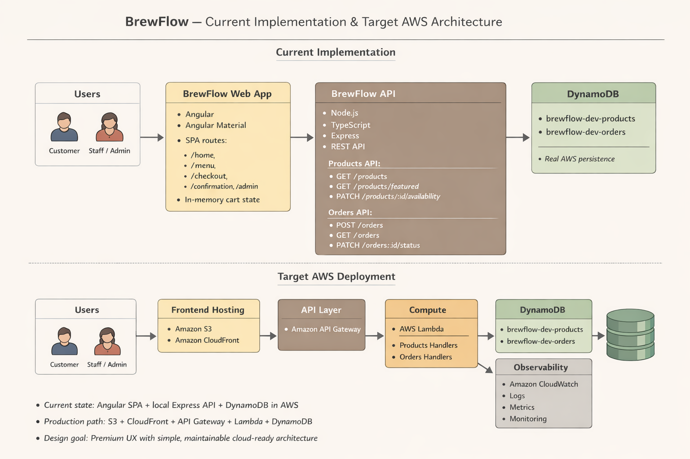
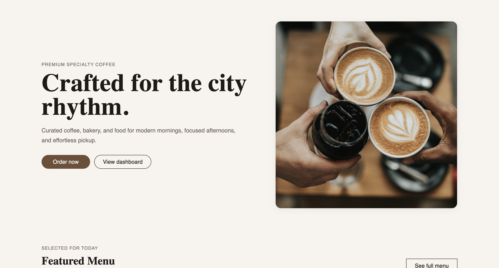
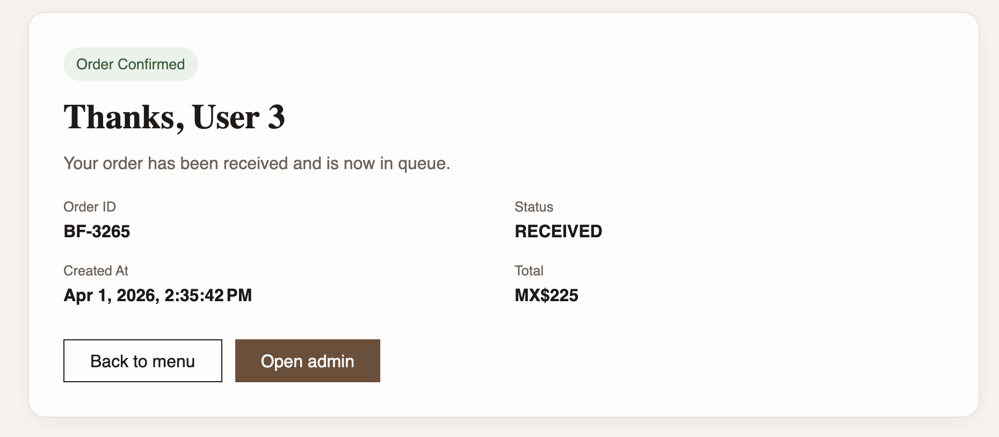
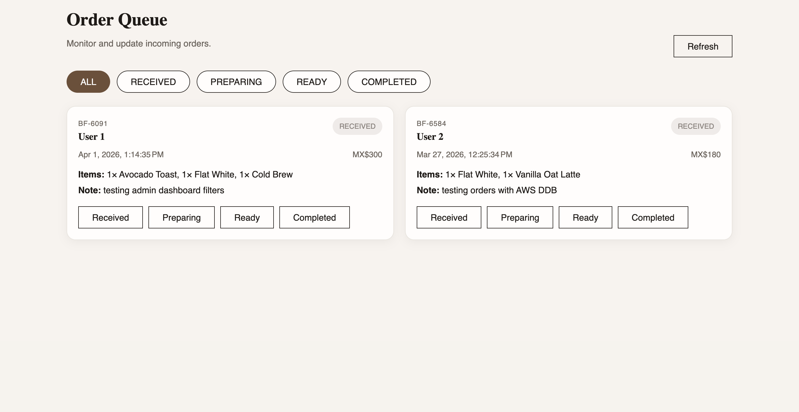

# BrewFlow ☕

Premium coffee shop ordering system designed for urban, high-income users.

---

## Overview

BrewFlow is a full-stack web application that allows customers to browse a curated coffee menu, place orders, and track their status, while staff manage orders through an admin dashboard.

The project focuses on:
- clean and premium UX/UI
- maintainable full-stack architecture
- cloud-ready design (AWS)

---

## Tech Stack

### Frontend
- Angular
- Angular Material

### Backend
- Node.js + TypeScript
- Express

### Database
- DynamoDB

### Cloud (current + target architecture)
- Current: local Angular app + local Express API + DynamoDB in AWS
- Target: S3 + CloudFront (frontend hosting)
- API Gateway + Lambda (API layer)
- DynamoDB (data storage)
- CloudWatch (logging & monitoring)

---

## Architecture



---

## Design
See the full design system:
[Design System](./docs/design-system.md)

---

## Features

### Customer
- Browse menu by category (Coffee, Bakery, Food)
- Search products
- View product details (modal)
- Add/remove items in cart (drawer)
- Place order
- Receive order confirmation with ID and status

### Admin
- View order queue
- Filter orders by status
- Update order status
- Toggle product availability

---

## Screens

### Home


### Menu


### Product Modal


### Confirmation


### Admin Dashboard


---

## API
- GET /products
- GET /products/featured
- PATCH /products/:id/availability

- POST /orders
- GET /orders
- PATCH /orders/:id/status


---

## Data Models

### Product
```ts
type Product = {
  id: string;
  name: string;
  category: string;
  description: string;
  price: number;
  imageUrl: string;
  available: boolean;
  featured: boolean;
};
```
### Order
```ts
type Order = {
  id: string; // e.g. BF-1042
  customerName: string;
  note?: string;
  items: OrderItem[];
  total: number;
  status: 'RECEIVED' | 'PREPARING' | 'READY' | 'COMPLETED';
  createdAt: string;
};
```

### OrderItem
```ts
type OrderItem = {
  productId: string;
  name: string;
  quantity: number;
  price: number;
};
```


### Running Locally
```sh
cd backend
npm install
npm run dev

cd frontend/app
npm install
ng serve
```

### Seed products
```sh
cd backend
npm run seed:products
```

### Future Improvements
Authentication (customer & staff)
Payments integration
Inventory management
Real-time order tracking
Analytics dashboard


### Author

Built by Alfonso Leon

